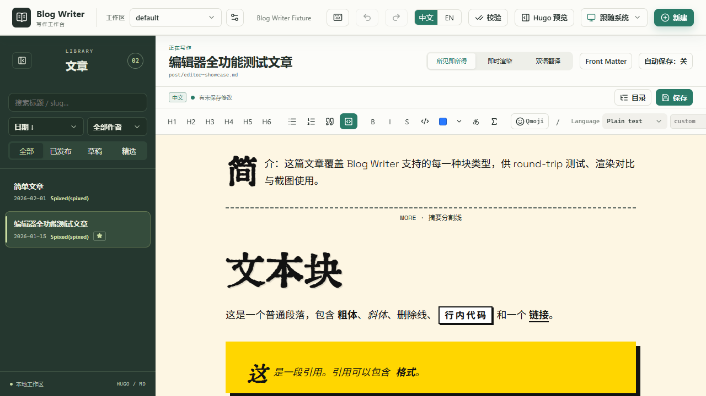
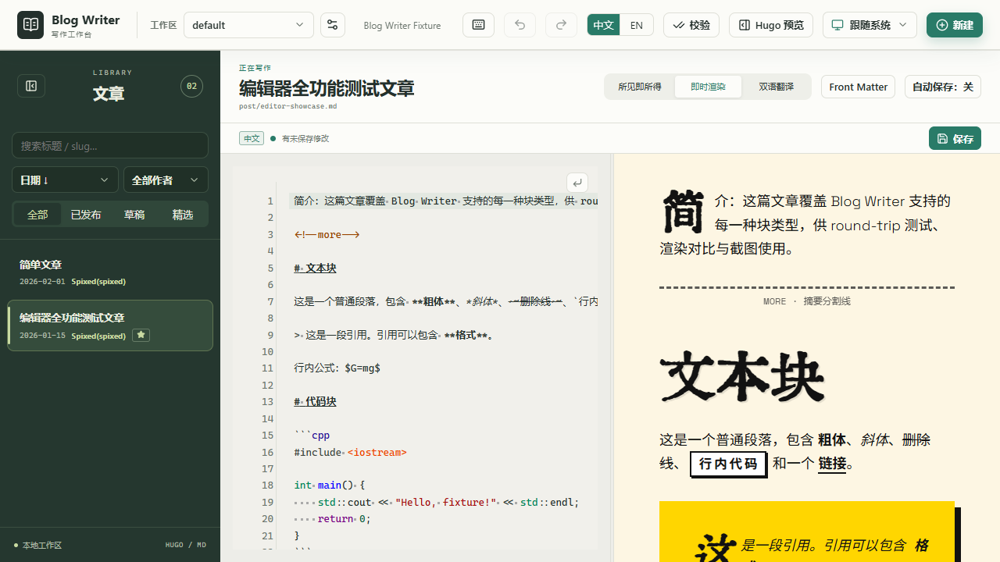
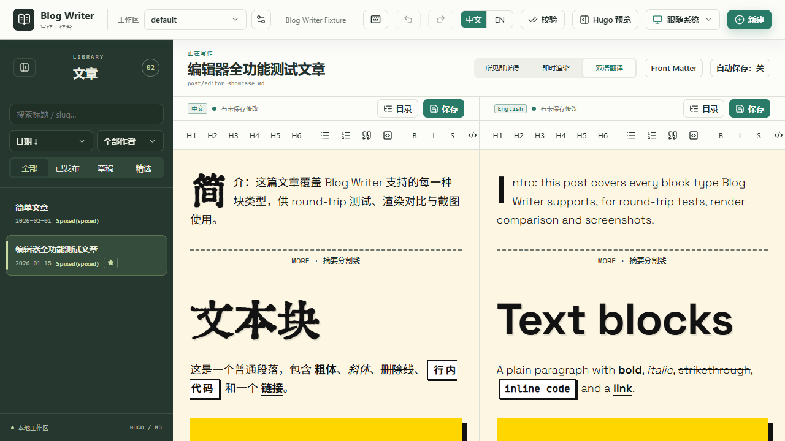
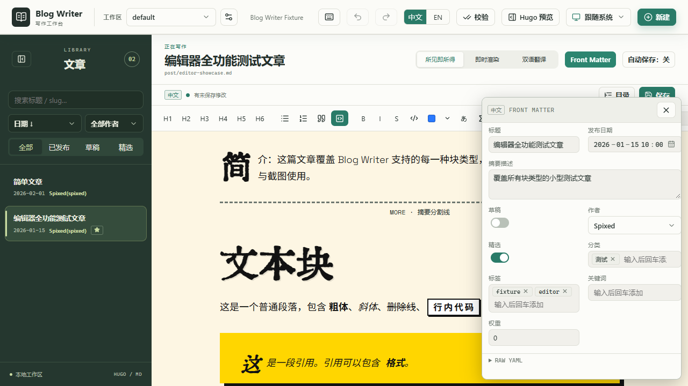

<div align="center">

# Blog Writer

**面向 Hugo 博客的桌面级编辑器，围绕 polymer 主题构建。**

三种编辑模式 · 浮动 front-matter 面板 · 完整的文章管理

[](https://github.com/Spixed/blog-writer-web/actions/workflows/ci.yml)
[](LICENSE)
[](https://bun.sh)

[English](README.md) · 简体中文

</div>

---

项目以 Web UI 为先：同一套前端之后可直接复用于 Electron / Tauri 壳（以及
未来某天的 gpui）。前端只与 `WorkspaceApi` 契约通信，切换壳仅需替换
`src/api/index.ts` 中的适配器。

## 特性

- **三种编辑模式**
  - **所见即所得** — Notion 风格的 TipTap 编辑面：直接编辑散文块，支持
    悬浮把手拖拽排序、侧栏 `+` 插入、固定格式工具栏、选区气泡菜单，以及
    带分组、文本过滤和方向键导航的斜杠命令面板（`/`）。
  - **分栏渲染** — 纯 Markdown | 实时渲染，滚动同步。
  - **双语模式** — 两个 WYSIWYG 编辑面、滚动同步，重命名/删除感知双语
    文章的配对关系。
- **非文本块可编辑，而非黑盒** — 行内 `` 和 ``
  由同一条管线渲染为行内原子（含 lottie），行内 `{}` 是着色
  mark，图片按主题的 figure 样式内联展示并支持 `?width=`，GFM 表格是
  真正的 TipTap 表格，Qmoji 原子支持行内与块级两种呈现。多行 `hl`、块级
  公式、原始 HTML 和缩进代码块则以逐字保留的 `rawBlock` 原子经预览管线
  渲染 —— 看起来与博客完全一致，且保存时逐字节还原。
- **逐字节精确的 round-trip 保证** — 读取文章再写回，文件必须逐字节
  一致（包括 CRLF 文件，以及 JSON 引入的 Date 与字符串漂移）。在
  WYSIWYG 模式下，散文块按规范重新序列化，复杂块则携带逐字原文。
- **Front matter** — 每种模式均可用的可拖拽浮动面板，可视化表单与
  Raw YAML 视图保持同步。
- **文章管理** — 搜索 / 过滤 / 排序，新建 / 重命名 / 删除（含双语配对），
  通过文章列表右键菜单操作，可撤销（Ctrl+Z / Ctrl+Shift+Z）。
- **渲染管线** — markdown-it 运行于 Web Worker，支持主题的三个
  shortcode（`hl`、`qq-emoji`、`ruby`）、MathJax v4、Shiki
  （Chroma/Monokai）、图片 figure 与 `<!--more-->`。
- **忠实主题样式** — 内容由主题自身的 CSS、字体栈和首字下沉尺寸
  （每次编辑、缩放和字体加载后重新测量）驱动，编辑器与实时渲染效果和
  博客一致。主题跟随系统配色。
- **源码模式** — CodeMirror 6，支持 Markdown 与 shortcode 补全、可见
  空白符、缩进，以及内置的查找/替换面板。
- **后端** — Fastify + WebSocket：文章 CRUD、配置、分类法、文件监听
  （文章、媒体、data、配置、主题 —— 新增/修改/删除与冲突状态，绝不
  静默覆盖未保存的草稿）、Hugo 集成、媒体库与上传流程。
- **细节** — slug 接受任意 Unicode 字母或数字（`birthday_δ-me13` 也可用），
  自动保存可配置（250–10,000 ms，默认 1,000 ms，默认关闭；
  Ctrl/Cmd+S 始终可用），分栏模式会隐藏首块之上无意义的空行但不改动
  文件，支持多工作区。

## 截图

<div align="center">
<table>
  <tr>
    <td></td>
    <td></td>
  </tr>
  <tr>
    <td align="center">所见即所得</td>
    <td align="center">分栏渲染</td>
  </tr>
  <tr>
    <td></td>
    <td></td>
  </tr>
  <tr>
    <td align="center">双语翻译</td>
    <td align="center">Front Matter 浮动面板</td>
  </tr>
</table>
</div>

## 环境要求

- [Bun](https://bun.sh) ≥ 1.2
- [Hugo](https://gohugo.io)（可选 —— 校验/预览按钮和渲染测试需要）

## 快速开始

```bash
bun install
bun dev
```

- 后端：<http://127.0.0.1:7841>（Fastify + WebSocket）
- 前端：<http://localhost:5173>（Vite，代理 `/api` 与 `/ws`）

如需在另一台设备（如同一局域网内的平板）上访问开发服务器，传入
`--host`：

```bash
bun dev --host                # 两个服务器均绑定 0.0.0.0
bun dev --host 192.168.1.10   # 绑定到指定地址
```

单独的 `--host` 等价于 `--host 0.0.0.0`。不传时两个服务器只监听
loopback。

## 配置

博客根目录在 `.env` 中配置（`BLOG_ROOT`，见
[`.env.example`](.env.example)），用于在首次运行时预注册默认工作区。
也可以在界面中选择目录；该选择会持久化到
`~/.blog-writer/config.json`。支持多工作区。

## 项目结构

```
packages/
  shared/        类型、WorkspaceApi 契约、front-matter schema、shortcode 规格
  frontend/      React + Vite UI（Electron/Tauri 原样复用）
  server-node/   Fastify 后端（Electron 主进程复用）
  electron/      （P5）
  tauri/         （P5）
```

## 测试

```bash
bun test                                     # 对每篇文章做逐字节一致的 round-trip（本地、安全）
bun run --filter @blog-writer/server-node test:api   # 同上，走 HTTP 层

# 在 packages/frontend 下：
bun run test:blocks    # 每个块与 Hugo 渲染一致，编辑为逐字节等价的空操作
bun run test:prose     # 每篇文章：Markdown -> WYSIWYG -> Markdown 稳定且无损
bun run test:schema    # 每篇文档的 WYSIWYG 文档是合法的 ProseMirror 文档
bun run test:render    # 完整 Hugo 构建 + 逐块 HTML diff（需要 Hugo）
bun run test:ui        # 三种编辑模式的 SSR 冒烟测试
bun test test/editor-regressions.test.ts # 源码补全 / 标题滚动回归
```

浏览器回归（先启动 `bun dev`；脚本使用 Playwright CLI）：

```bash
playwright-cli -s=ui open http://localhost:5173/
playwright-cli -s=ui run-code --filename=packages/frontend/test/browser-layout.js
playwright-cli -s=ui run-code --filename=packages/frontend/test/browser-editor.js
playwright-cli -s=ui run-code --filename=packages/frontend/test/browser-interactions.js
playwright-cli -s=ui run-code --filename=packages/frontend/test/browser-performance.js
playwright-cli -s=ui run-code --filename=packages/frontend/test/browser-performance-p4.js
```

这些脚本覆盖媒体稳定性、双向标题对齐、caption 与语言编辑、Qmoji 替换、
斜杠命令和保存防抖。编辑/保存测试中的写请求会被拦截；博客文件不是
可供测试改动的 fixture。脚本假定已配置好样例博客。

P4 性能探针会创建一个 62 KiB 的混合文档，进行输入和滚动，并记录
`longtask` 条目。本地一次测量的结果是：插入耗时中位数 0.4 ms、p95
0.7 ms、最大 2.7 ms，无 long task。它是一个可重复的本地验收探针；
硬件与浏览器差异会改变数值。

## 编辑控件

- 在段落开头或空白后输入 `/`，点击工具栏中的 `/`，或悬浮块并点击侧栏
  `+`。方向键选择命令，回车插入，Escape 关闭。拖动侧栏把手可重排块。
- `hl` 与 `ruby` 同时存在于气泡菜单和斜杠面板；`qq-emoji` 只在斜杠面板
  中，会打开可搜索的可视化选择器（基于站点的 emoji 映射）。
- 选中 Qmoji 可替换它，或在工具栏中切换行内/块级呈现。选中 Ruby 文本可
  编辑其正文与注音。图片带可编辑的 caption；选中图片还会暴露其 URL 与
  title。
- 光标进入代码块即可选择语言或输入自定义名称。
- 源码模式下，`{{<` / `{{%` 与 `/` 提供语法片段，Tab 缩进，
  Ctrl/Cmd+F 打开查找/替换。
- 自动保存默认**关闭**。启用后，顶栏可调 250–10,000 ms 延迟（默认
  1,000 ms）；Ctrl/Cmd+S 与保存按钮始终可用。
- 图片对话框包含媒体库与上传流程。

交互设计参考了
[Lexical](https://github.com/facebook/lexical)（键盘驱动的组件选择器）、
[BlockSuite](https://github.com/toeverything/BlockSuite)（块操作与上下文
控件）和 [Editor.js](https://github.com/codex-team/editor.js)（块插入与
设置）。编辑器继续使用 ProseMirror/Tiptap，以保留其现有的 Markdown 与
Hugo shortcode 表示方式。

## 路线图

| 阶段 | 范围 | 状态 |
| --- | --- | --- |
| P0 | 基础设施：monorepo、Workspace API 契约、Fastify 后端、Vite 壳 | ✅ |
| P1 | 文章管理 + 可视化 front matter、自动保存、Ctrl+S | ✅ |
| P2 | 渲染管线：Web Worker、shortcode、MathJax、Shiki、Hugo 校验（14 篇 / 900 块） | ✅ |
| P3 | 三种模式、浮动 front-matter 面板、可撤销的重命名/删除 | 🔧 |
| P4 | 媒体管理器、查找与替换、性能打磨 | ⏳ |
| P5 | Electron / Tauri 壳 | ⏳ |
| P6 | gpui 原生（待生态就绪） | ⏳ |

WYSIWYG 编辑面与实时渲染之间的像素级视觉一致性尚未成为自动化验收保证。

## 参与贡献

欢迎贡献 —— 环境搭建、PR 前需要运行的检查，以及对解析/序列化改动的
round-trip 保证要求，请见 [CONTRIBUTING.md](CONTRIBUTING.md)。

## 许可证

[MIT](LICENSE)
